# Terminal Todo

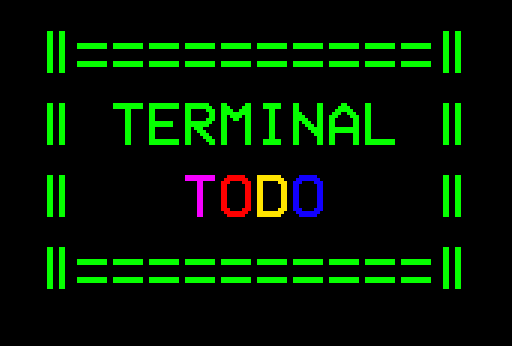

Usando a lib [**readline-sync**](https://www.npmjs.com/package/readline-sync), \*\*\*\*crie uma todo-list via terminal que aceite os seguintes comandos

- add
- list
- check
- remove

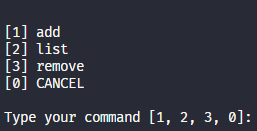

A opção _CANCEL_ é adicionada automaticamente quando usamos `readlineSync.keyInSelect`.

- Requisitos

  1. Ao selecionar "add", deve perguntar qual a todo a ser adicionada e então adicionar a uma todo como string numa array em memória.

     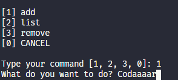

  2. Ao selecionar "list" deve listar todas as todos, uma todo para cada linha.

     (O bullet vermelho foi feito com emoji 🔴)

     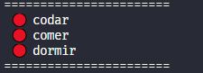

  3. Ao selecionar "check", deverá marcar a todo como feita se ainda não estiver assim marcada (emoji 🟢 ou outra experiência que você preferir) ou então desmarcar caso contrário.

     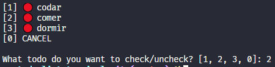

     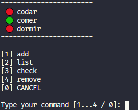

  4. Ao selecionar "remove" deve listar todas as todos e perguntar qual deseja remover e então remover da lista. (procure por `splice`)

     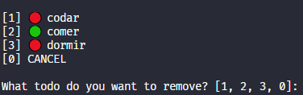

     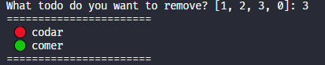

- Bônus 1

  Faça com que a lista de todos tenha persistência salvando-a num arquivo `json` a cada modificação e recuperando-o ao iniciar o programa. (Procure por `fs.existsSync`, `fs.writeFileSync`, `fs.readFileSync`.

- Bônus 2

  Adicione mais um comando chamado "pomodoro" que pergunta para qual item deseja fazer um pomodoro. Ao selecionar o item, inicie a contagem de um pomodoro de 25min. Após esse tempo, adicione um marcador de quantidade de pomodoros ao final do item.

  1. Novo comando

     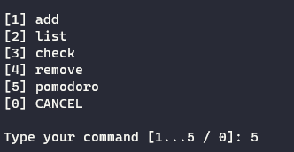

  2. Setar pomodoro

     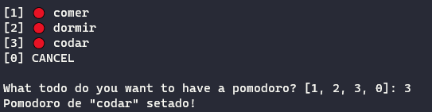

  3. Exibir contagem de pomodoro ao lado da tarefa (um tomatinho para cada pomodoro realizado naquela tarefa)

     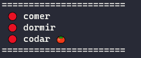
